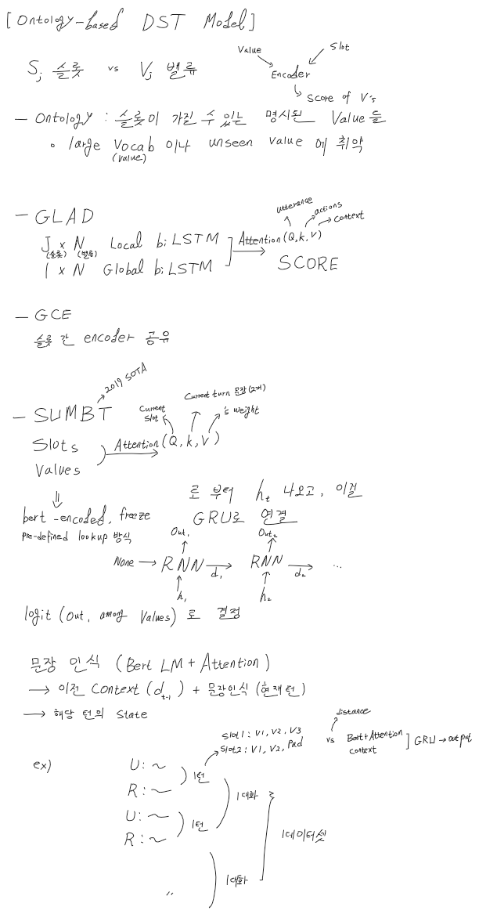

### Task-oriented dialogue vs Open-domain dialogue(Chit-chat)

Open-domain dialogue 는 자연스러움이 중요하지만, Task-oriented는 task의 수행성공여부가 중요함.

### TaskOrientedDialogue
Pre-defined scenario 에서 Task schema 를 수행
- Task-schema  
  유저는 자신의 상황을 Informable slot으로 설명하고 서버에 Request
  서버는 Informable slot과 Request를 참고하여, Requestable slot에서 정보를 제공한다.
  이 때, Informable slot 들을 추적하는 것이 Dialogue state tracking 이다.
```B_t = seq2seq(B_t-1, R_t-1, U_t-1)```
현재턴의 슬롯들 = 이전턴의 슬롯들 + 이전턴의 User대화&Response대화
  
### Ontology-based DST Model
#### Sumbt


### Open-vocab DST
#### DST-Reader
Reading comprehension(기계독해) 관점에서 접근. slot추출+예측 generation 방식
#### TRADE
values 를 크게 세가지
none / don't care / values
로 분류하고, values면 해당 generation 결과를 사용

### Hybrid(Ontology + Generation)
#### DS-DST model
Categorical slot -> Ontology model
Non-categorical slot -> Open-vocab model 

### ITC efficient DST model
#### COMER
hierachical decoder 를 써서, fully generate함. 계산복잡도를 줄임
#### NA-DST
